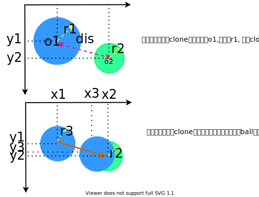
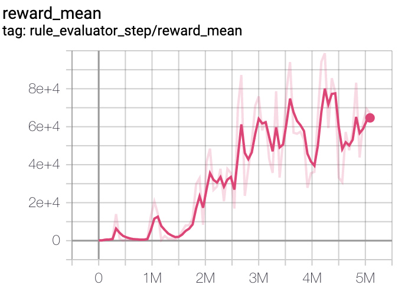

# Gobigger-Explore
## :crystal_ball: GoBigger Challenge 2021 Baseline
[en](https://github.com/opendilab/Gobigger-Explore/blob/main/README.md)/[中文](https://github.com/opendilab/Gobigger-Explore/blob/main/README_zh.md)

## :robot: 介绍
这是2021年GoBigger Multi-Agent Decision Intelligence [Challenge](https://www.datafountain.cn/competitions/549)的基线。基线基于[OpenDILab](https://github.com/opendilab/DI-engine)并旨在提供一种简单的入门级方法。参赛选手可以通过扩展提供的基线方法来构建智能体。此外，OpenDILab的模块化结构让参与者可以轻松读懂代码，并且提供了丰富的强化学习算法供参与者使用。对于熟悉多智能体决策AI问题的入门级研究人员来说，这个基线具有较好的指导意义。

## :rocket: 发布版本
当前版本为最新的版本v-0.3.0。
1. 未来版本预告
   - 高级算法的应用。
   - 高级动作的设计及学习。
2. 监督学习
   - 采用bot对打生成监督学习的训练工具，[生成脚本](https://github.com/opendilab/Gobigger-Explore/blob/main/my_submission/sl/generate_data_opensource.py) for supervised learning.
   - 监督学习的模型可以作为Agent，也可作为强化学习的pre-train。
   - 详情可见[SL](https://github.com/opendilab/Gobigger-Explore/blob/main/my_submission/sl/)
3. 采用Go-Explore算法训练Gobigger
   - 通过加载残局比赛从而加快网络训练。
   - 详情可见[go-explore](https://github.com/opendilab/Gobigger-Explore/blob/main/my_submission/go-explore/)
4. Version-0.3.0
   - 采用原地算法in-place以及梯度累积策略，节省显存空间。
   - 高效编码 Version-0.2.0 relation部分的特征。
   - 更小的网络模型以及高效的训练过程设计。
5. Version-0.2.0
   - [version-0.2.0版本链接](https://github.com/opendilab/Gobigger-Explore/releases/tag/v0.2.0)
   - 修复ckpt bug, 提升evaluator评估器的准确性。
   - 修复replay_buffer bug。
   - replay_buffer存放不定长特征，提升数据利用率及训练速度。
6. Version-0.1.0
   - [version-0.1.0版本链接](https://github.com/opendilab/GoBigger-Challenge-2021/tree/main/di_baseline)
7. 特征工程
   - 全新的特征工程以及网络结构,提升收敛速度。
      - Scalar Encoder 
        
        - 默认左上角为坐标原点。
        - 图中红色矩形为全局视野，绿色矩形为局部视野。
   
      - Food Encoder
         - 为方便计算，面积计算采用半径的平方,省去常数项。
         - food map将局部视野进行切分为h*w个小格子,每个小格子的大小为16\*16。
         - food map[0,:,:]表示落在每个小格子中food的累积面积。
         - food map[1,:,:]表示落在每个小格子中当前id的clone ball的累积面积。
         - food grid将局部视野进行切分为h\*w个小格子,每个小格子的大小为8*8。
         - food grid表示每个小格子中food相对于所属格子的左上角的偏移量以及food的半径。
         - food relation 的维度是[len(clone),7\*7+1,3]。其中[:,7\*7,3]表示
         示每个clone ball的7*7网格邻域中food的信息，包括偏移量以及网格中food面积平方和。因为覆盖率很低，在这里做了一个近似，food的位置信息以最后一个为准。[len(clone):,1,3]表示每个clone ball自身的偏移量以及面积。
      - Clone Encoder
         - 对clone ball进行编码，包括位置、半径、玩家名称的one-hot编码以及clone ball的速度编码。 
      - Relation Encoder
         - ball_1 与ball_2 的相对位置大小关系,(x1-x2,y1-y2)。
         - ball_1 与ball_2 的距离,即o1与o2之间的距离dis。
         - ball_1 与ball_2 的碰撞是一个球的圆心出现在另一个球中，即发生碰撞。
         - ball_1 与ball_2 是否相互碰撞,即一个球的圆弧与另一个球圆心之间的距离。
         - ball_1 与ball_2 分裂后相互碰撞，即分裂后最远的分裂球的圆弧与另一个球圆心之间的距离。
         - ball_1 与ball_2 吃与被吃关系，即两球之间的半径大小关系。
         - ball_1 与ball_2 分裂后吃与被吃关系，即分裂后两球之间的半径大小关系。
         - ball_1 与ball_2 各自的半径做映射, 分别为m\*n个r1 和m\*n个r2, m表示ball_1的数量，n表示ball_2的数量。 
         
      - Model
          - mask的作用，记录padding后的有效信息。需结合代码理解更佳。 
          - Baseline中的model设计并不是最好的，选手可以尽情脑洞！
          
8. 与Bot对打的胜率
   - Version-0.3.0 基于规则的Bot位于[Gobigger](https://github.com/opendilab/GoBigger/blob/main/gobigger/agents/bot_agent.py)。
   
9. 版本对比
   - Version-0.3.0 VS Version-0.2.0
      - v0.3.0更加轻量化，网络设计与特征编码易于上手。
      - v0.3.0reward及Q值曲线
      
      
      
## :point_down: 让我们开始吧

1. 实验环境
   - CPU核心数 Core 8
   - GPU显卡 1080Ti(11G) or 1060(6G)
   - Memory内存 40G
2. 基线参数
   
   - 默认的参数[config](https://github.com/opendilab/Gobigger-Explore/blob/main/my_submission/config/gobigger_no_spatial_config.py)即仓库中开源的参数。参赛选手需根据自己的实验环境配置进行修改。
   - replay_buffer_size的大小需根据系统内存的大小调节。
   - batch_size的大小需要根据显存的大小调节。
   
3. 安装必要的依赖库
```
    # Install DI-engine
    git clone https://github.com/opendilab/DI-engine.git
    cd YOUR_PATH/DI-engine/
    pip install -e . --user

    # Install Env Gobigger
    git clone https://github.com/opendilab/GoBigger.git
    cd YOUR_PATH/GoBigger/
    pip install -e . --user
```

4. 开始训练
```
    # Download baseline
    git clone https://github.com/opendilab/Gobigger-Explore.git
    cd my_submission/entry/
    python gobigger_vsbot_baseline_simple_main.py
```

5. 评估并保存视频
```
    cd my_submission/entry/
    python gobigger_vsbot_baseline_simple_eval.py --ckpt YOUR_CKPT_PATH
    # 无需保存视频,需取消注释gobigger_env.py 258行
    python gobigger_vsbot_baseline_simple_quick_eval.py --ckpt YOUR_CKPT_PATH
```

6. SL训练
```
   cd my_submission/sl/
   python generate_data_opensource.py #生成训练数据
   python train.py -c ./exp/sample/config.yaml #需要更改路径
```

7. Go explore
```
   cd my_submission/go-explore/
   python gobigger_vsbot_explore_main.py
```

## :dart: 实验结果
我们开源了训练的log信息，检查点文件以及评估的视频。链接如下，
   - Version 0.3.0
     - 百度云盘 [Link](https://pan.baidu.com/s/11JTsw197jfjfijxpghA06w)
        - 提取码: 95el
   - Version 0.2.0
     - 百度云盘 [Link](https://pan.baidu.com/s/11sBoLWBEN33iNycs8y7fsw)
        - 提取码: u4i6 

## :heart_eyes: 相关资源链接
   - [比赛主页链接](https://www.datafountain.cn/competitions/549)
   - Challenge Repo [github链接](https://github.com/opendilab/GoBigger-Challenge-2021)
   - DI-engine Repo [github链接](https://github.com/opendilab/DI-engine)
   - GoBigger Repo  [github链接](https://github.com/opendilab/GoBigger)


